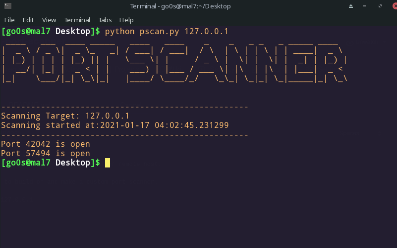

# SPPS (simple-python-port-scanner)
A python port scanner to check all ports for a local or remote host.

This is an ideal script to build on and make a custom port scanner.

<h2> usage: python pscan.py 127.0.0.1 </h2>

thego0n@mal7

PROPS to deepamanknp
https://www.geeksforgeeks.org/port-scanner-using-python/
